<h1> CNC: Classroom Network Controller </h1> 

 A platform for network access control in classrooms and laboratory 

  
<h2> CNC Architecture </h2> 

 The CNC architecture was designed so that teachers control the network traffic through a web platform.
This tool can be accessed by professors with SUAP credentials valid, from any device connected to the network
The CNC web platform, which is on the Web Server Play (PWS), was developed for LAN networks.
PWS is responsible for storing information about the teaching environments, users and computers in a database.
The Web Server API SUAP (WS) is responsible for authenticating users, granting or denying their access to the system.
Based on the information stored in the CNC database, it is possible to obtain the information needed to manage multiple network access control devices
(represented by Control Access Device - CODs). The CNC architecture is illustrated in Figure1. 

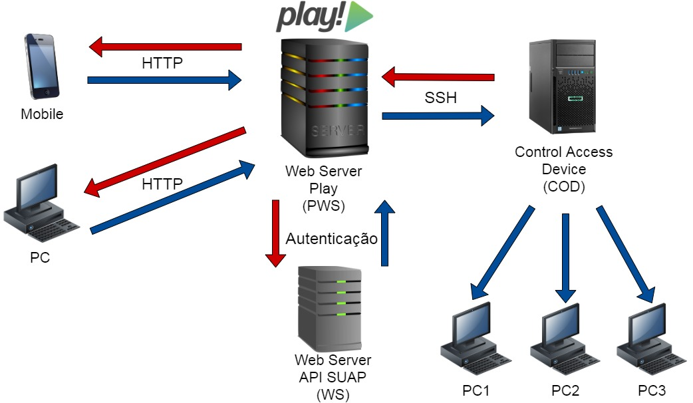
<h6 align="center"> Figure1. CNC Architecture </h6>
  
<h2> Technologies Used </h2> 
<dl>
  <dt> Back-end </dt>
    <dd> Pray Framework </dd>
    <dd> Iptables </dd>
    <dd> Ganymed SSH-2 Library </dd>
    <dd> API SUAP </dd>
  <dt> Front-end </dt>
  <dd> HTML5 </dd>
  <dd> CSS </dd>
  <dd> JavaScript </dd>
</dl>

<h2> Prerequisites </h2> 
<dl>
  <dt> All Devices </dt>
  <dd> Devices must be connected on the same LAN </dd>
  <dd> Have the same default gateway, IP address of COD. </dd>
  <dt> PWS Server </dt>
  <dd><a href="https://www.java.com/pt-BR/download"> Use Java8 </a></dd>
  <dd><a href="https://www.linux.org/pages/download/"> Use Linux Operating System </a></dd>
  <dd><a href="https://www.playframework.com/documentation/1.4.x/releases/releases"> Install the version 1.4.5 of Play Framework </a></dd>
  <dd> Enter the CNC project path in the computer's environment variables </dd>
  <dd> Start the CNC project on the terminal as a service using Play </dd>
  <dt> COD Devices </dt>
  <dd> A folder with the IPtables scripts </dd>
  <dd> An SSH server that accepts with username and password </dd>
  <dd> Internet access </dd>
</dl>

<h2> CNC Features </h2>
<ul>
  <li> Block/Unblock Internet access for one or more devices </li>
  <li> Block/Unblock access to specific websites for one or more devices </li>
  <li> Login via SUAP, restricted access for teachers </li>
  <li> Register non-teachers </li>
  <li> Delete non-teachers </li>
  <li> Edit data of non-teachers </li>
  <li> Register data from a website </li>
  <li> Delete data from a website </li>
  <li> Edit data from a websit</li>
  <li> Register laboratory and/or register computers that belong to it </li>
  <li> Delete laboratory and/or register computers that belong to it </li>
  <li> Edit laboratory and/or register computers that belong to it </li>
  <li> View user access log </li>
</ul>

 The CNC features are illustrated in Figure2. 

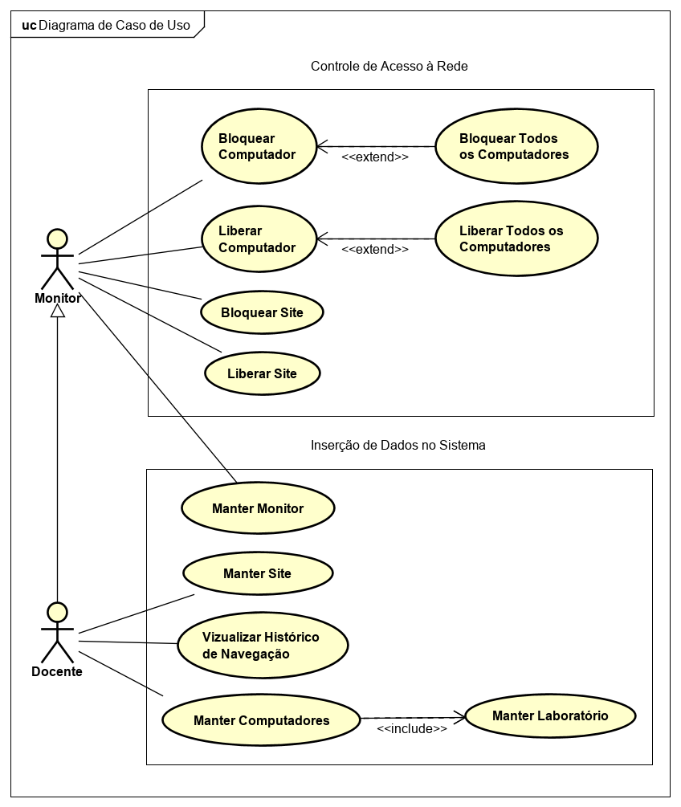
<h6 align="center"> Figure2. CNC Use Case Diagram </h6>

<h2> CNC Screens </h2>

 Login Screen 

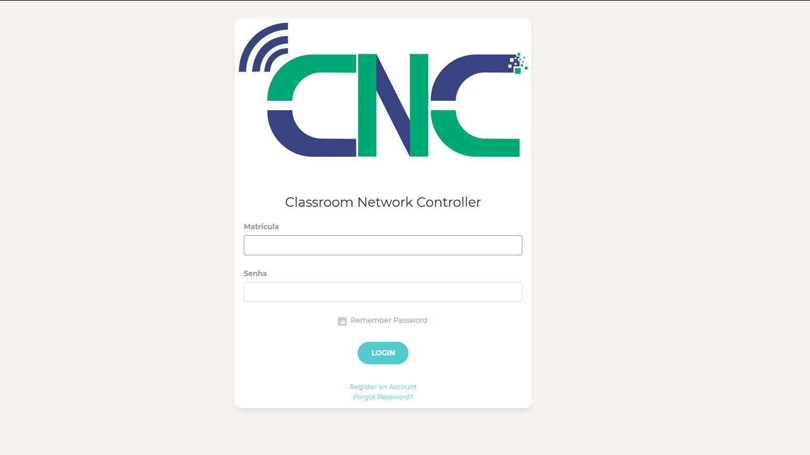
<h6 align="center"> Figure3. Login Screen </h6>

 Laboratory Registration Screen 

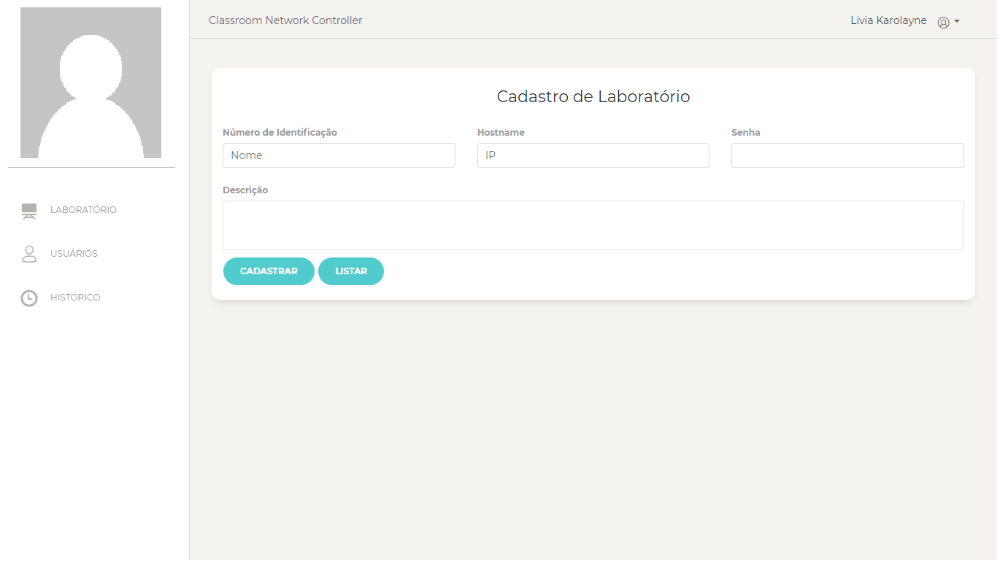
<h6 align="center"> Figure4. Laboratory Registration Screen </h6>

 Laboratory List Screen 

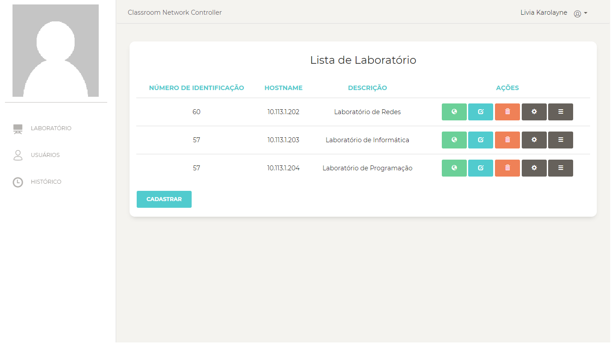
<h6 align="center"> Figure5. Laboratory List Screen </h6>

 Laboratory Details Screen 

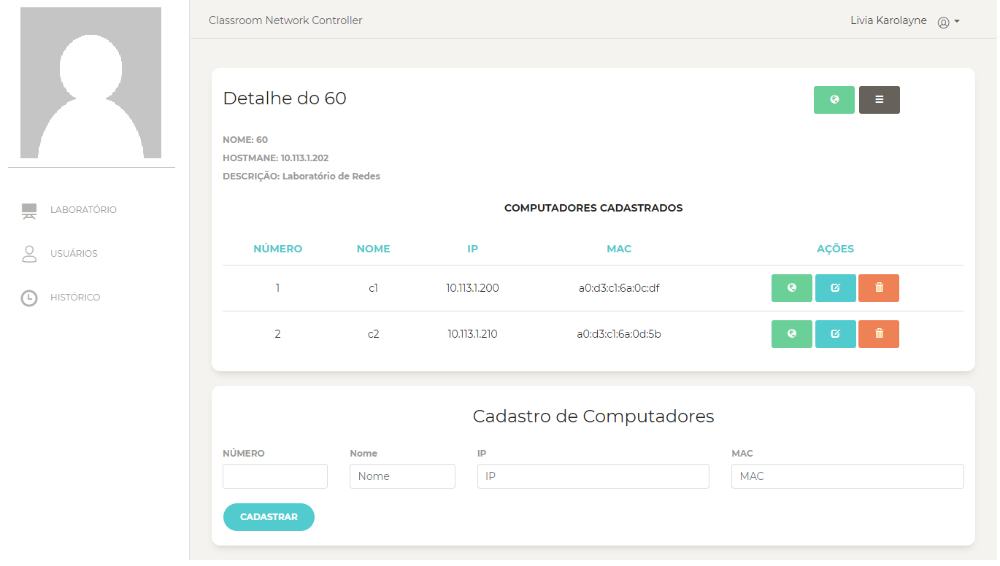
<h6 align="center"> Figure6. Laboratory Details Screen </h6>

 Laboratory Site List Screen 

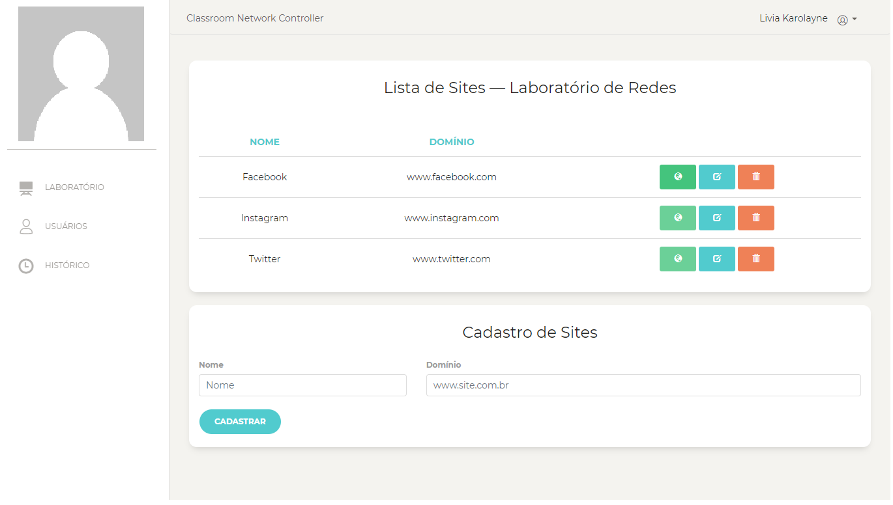
<h6 align="center"> Figure7. Laboratory Site List Screen </h6>

 Registration/Editing Computer Screen 

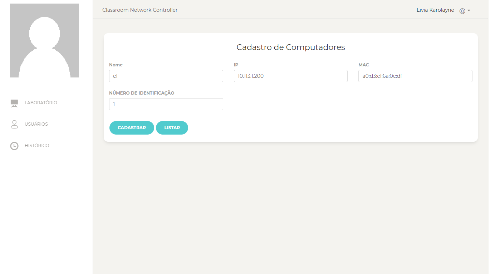
<h6 align="center"> Figure8. Registration/Editing Computer Screen </h6>

 User Registration Screen 

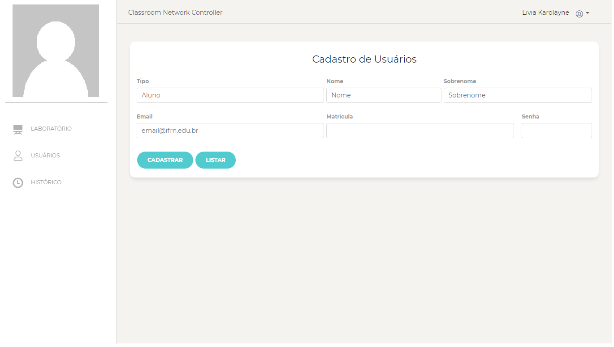
<h6 align="center"> Figure9. User Registration Screen </h6>

 User List Screen 

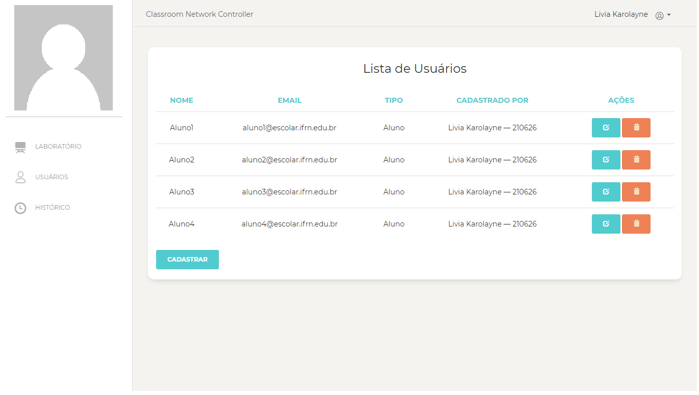
<h6 align="center"> Figure10. User List Screen </h6>

 Access History Screen 

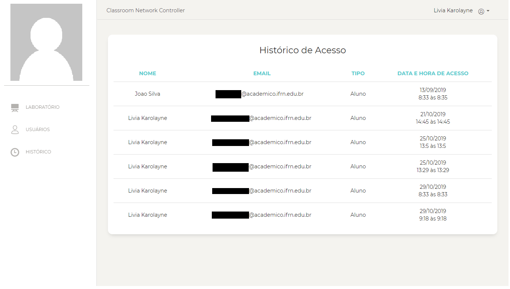
<h6 align="center"> Figure11. Access History Screen </h6>

<h2> ⚠️ Project under maintenance <h2/>

 Recently, the SUAP API has been changed, so the CNC System must be updated 

